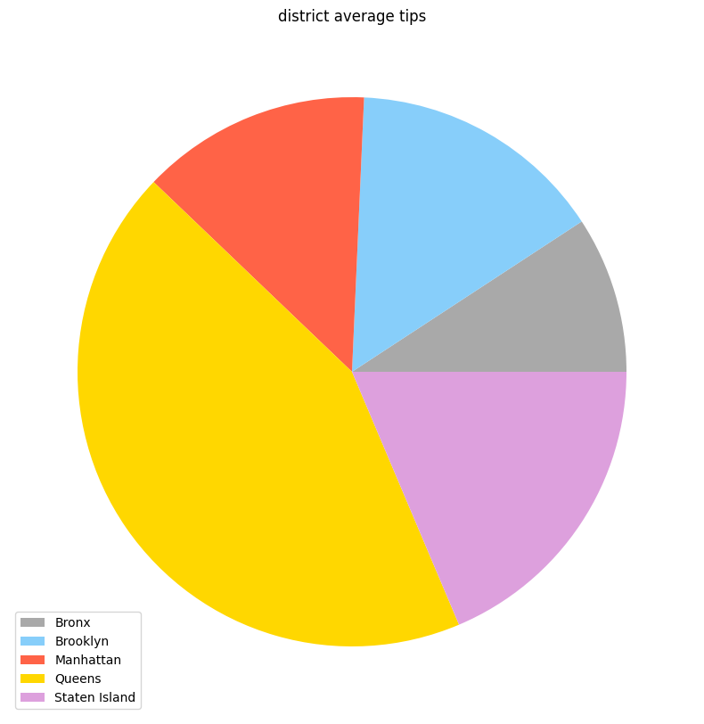

# NYC Taxi Analysis 
This project analyzes real-world cab data from 2018 and examines various facets of the industry. Metrics examined include identifying the center of NYC based on trip data, empty run patterns, connections to airports, and tip distribution.

## Getting Started
This README provides a comprehensive overview of the analysis findings, along with convenient links to the corresponding Jupyter Notebooks containing the code used to derive these results. Each analysis result is associated with a specific Jupyter Notebook, allowing you to explore the underlying code and methodologies.

### Getting Started with Jupyter Notebooks
If you are new to Jupyter Notebooks, consider the following steps:

*Installation:* Ensure that you have Jupyter Notebook installed. If not, follow the installation instructions provided in the respective documentation.
*Opening Notebooks:* Simply click on the provided links to access the Jupyter Notebooks. These notebooks contain the code and explanations for each analysis.
*Running Code:* Within the notebooks, you can execute code cells to replicate the analyses or modify them according to your specific needs.

# Results

* [Distribution of taxi trips per district of New York City](#distribution-of-taxi-trips-per-district-of-new-york-city)
* [200000+ Trips per zone](#200000-trips-per-zone)
* [Manhattan (NYC) center based on trip data](#manhattan-nyc-center-based-on-trip-data)
* [Trips from/to Manhattan](#trips-fromto-manhattan)
* [Trips from/to airports](#trips-fromto-airports)
* [Distribution of trips below/above average](#distribution-of-trips-belowabove-average)
* [Empty runs](#empty-runs)
* [Tips](#tips)
* [Tips at airport connections](#tips-at-airport-connections)

## Distribution of taxi trips per district of New York City
By examining the patterns and trends, we aim to gain insights into the city's mobility dynamics and the factors that influence the spatial distribution of cab trips.

[Jupyter Notebook](analyses/distribution.ipynb)

### Distribution of customer pickups

### Distribution of customer dropoffs

## 200000+ Trips per zone
In the pursuit of optimizing taxi services within Manhattan, an examination of zones with 200,000 taxi trips reveals that all but two outliers, namely the zones housing JFK and LaGuardia airports, align with the predetermined center of Manhattan. Furthermore, this insight underscores the significance of these airport-centric anomalies in the broader transportation network analysis.

[Jupyter Notebook](analyses/200000+.ipynb)

## Manhattan (NYC) center based on trip data
Determining the center of the main district Manhattan borough based on taxi data provides a fascinating insight into the dynamic diversity of this metropolis, allowing for a precise localization of the pulsating heart of New York City.

[Jupyter Notebook](analyses/center.ipynb)

### Pickups in Manhattan

### Dropoffs in Manhattan

## Trips from/to Manhattan
Delving into the intricate web of taxi transportation in relation to Manhattan, this chapter focuses on a comprehensive analysis of trips originating from and destined for the heart of the city. By scrutinizing the intricate patterns of these journeys, a nuanced understanding of the connectivity between Manhattan and its surrounding areas emerges, shedding light on the dynamics that shape the urban transport landscape.

[Jupyter Notebook](analyses/from-to.ipynb)

### Trips from Manhattan

### Trips to Manhattan

## Trips from/to airports
Turning our attention to the identified outliers, specifically the two major airports, JFK and LaGuardia, this chapter delves into a detailed examination of taxi trips to and from these aviation hubs.

[Jupyter Notebook](analyses/airports.ipynb)

### Trips from airports

### Trips to airports

## Distribution of trips below/above average
Navigating the spectrum of trip distances, this chapter explores the dichotomy between journeys below and above the average. In doing so, we aim to discern patterns that align with commuting routes from various districts to Manhattan, as well as ascertain correlations with trips originating from the airports and converging towards the central nexus of New York City.

[Jupyter Notebook](analyses/lower-upper.ipynb)

### Distribution of lower distance trips based on the customer pickups

### Distribution of lower distance trips based on the customer pickups

### Center of Manhattan based on lower distance pickups

### Center of Manhattan based on upper distance pickups

### Distribution of lower distance trips based on the customer dropoffs

### Distribution of lower distance trips based on the customer dropoffs

### Center of Manhattan based on lower distance dropoffs

### Center of Manhattan based on upper distance dropoffs

## Empty runs
Delving into the strategic maneuvers of taxi drivers, this chapter investigates the phenomenon of empty runs—instances where cabs reposition without passengers with the goal of optimizing earnings.

[Jupyter Notebook](analyses/empty-runs.ipynb)

### Distribution of empty run starts per district of New York City

### Distribution of empty runs with the start in Manhattan

### Distribution of empty run ends per district of New York City

### Distribution of empty runs with the end in Manhattan

## Tips
Shedding light on the financial nuances of taxi transactions, this chapter delves into the realm of tip amounts and their potential correlation with the preceding strategies of empty runs and driver repositioning. By scrutinizing tipping patterns in conjunction with the strategic maneuvers observed earlier, we aim to uncover insights into the intricate interplay between customer gratuity and the optimization strategies employed by taxi drivers.

[Jupyter Notebook](analyses/tips.ipynb)

### Tip amount for each district in NYC

## Tips at airport connections
Examining the tipping landscape through the lens of airport travel, this chapter investigates tip amounts associated with trips to and from airports. With a specific focus on discerning patterns in tipping behavior from tourists, we aim to uncover whether there is a notable variance in tip amounts for airport journeys, shedding light on the dynamics of gratitude in the context of travel to and from key transportation hubs.

[Jupyter Notebook](analyses/airport-tips.ipynb)

### Tips from/to airports

### Tip amounts from airports over the year

### Tip amounts to airports over the year
